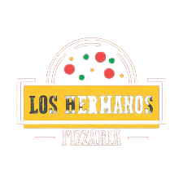

<h1 align="center">
  
</h1>

<!-- <p align="center">
     
</p> -->

<p align="center">
  <a href="#-tecnologias">Tecnologias</a>&nbsp;&nbsp;&nbsp;|&nbsp;&nbsp;&nbsp;
  <a href="#-projeto">Projeto</a>&nbsp;&nbsp;&nbsp;|&nbsp;&nbsp;&nbsp;
  <a href="#-como-usar?">Como usar?</a>&nbsp;&nbsp;&nbsp;&nbsp;&nbsp;&nbsp;
</p>

## 🚀 Tecnologias

Este projeto foi desenvolvido com as seguintes tecnologias:

- <a href="https://nodejs.org/en/">Node</a>
- <a href="https://expressjs.com/pt-br/">Express</a>
- <a href="https://www.typescriptlang.org/">Typescript</a>
- <a href="https://www.prisma.io/">Prisma</a>
- <a href="https://jestjs.io/pt-BR/">Jest</a>
- <a href="https://www.postgresql.org/">PostgreSQL</a>

## 💻 Projeto

Los Hermanos dashboard é uma API desenvolvida para o projeto de dashboard para gerenciamento da pizzaria Los Hermanos, a aplicação tem como objetivo controlar as vendas do estabelecimento e gerar gráficos de desempenho para que os proprietários possam analisar seu negócio e identificar pontos que com capacidade de melhora.
O sistema atualmente conta com as seguintes funcionalidades: 

- Cadastro de conta
- Cadastro de múltiplos usuários para mesma conta
- Autenticação de usuário
- Gerenciamento de produtos (Criação, Edição, Atualização e Deleção) 
- Gerenciamento de clientes (Criação, Edição, Atualização e Deleção)
- Gerenciamento de vendas (Criação, Edição, Atualização e Deleção)
- Levantamento de total diário arrecadado
- Levantamento de total arrecadado no mês
- Levantamento de total de pedidos no mês
- Balanço mensal, com criação de histórico anual
- Rankeamento de produtos mais vendidos

<!-- 
## ⌨ Como usar?

Em primeiro lugar, clone o repositório:

```bash
# Clonando o repositório
git clone https://github.com/hitaloalvess/dt-money.git

# ✅ Em sequência:

# Instale as dependências:
yarn install

# Iniciando projeto
yarn start
```
## 🔖 Layout

Você pode visualizar o layout do projeto através [desse link](https://www.figma.com/file/0xmu9mj2TJYoIOubBFWsk5/dtmoney-Ignite-(Copy)?node-id=0%3A1). É necessário ter conta no [Figma](https://figma.com) para acessá-lo. -->

## :memo: License

Este projeto está sob a licença do MIT. Veja o [LICENSE](https://github.com/hitaloalvess/loshermanos-dashboard-server/blob/main/LICENSE) para maiores informações.

---
Made with ♥ by Hitalo 🚀

